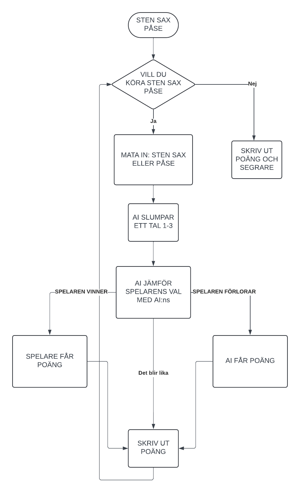

Kevins Loggbok

25-04-28
-----------------
Klar med uppgift 6. Dörrarna är fixade nu och man kan inte komma ut ur samma dörr som man går in i. Finns inte direkt något kvar för mig att pilla på i uppgift 6 om jag inte vill fixa alla små fel. Lärde mig inte direkt något nytt.

25-04-22
-----------------
Mer arbete på uppgift 6 finslipning och sådant. La till en timer på dörrarna så man kan bara passera efter nån sekunds väntan. Inte så mycket gjort idag. Om jag känner för det så är jag nog klar med uppgift 6, men det finns alltid mer att fixa. Ska nog koda in så att man inte kan komma ut ur samma dörr som man gick in i.

25-04-08
-----------------
Arbetade vidare på uppgift 6. Fixade till fiende rörelserna. Lärde mig lite mer om hur man använde dictionaries och använde det för enemy direction och switch som bestämmer fiendens riktning och flytt intervaller. Typ klar med uppgift 6 men borde nog fixa koden för dörrarna eftersom de inte funkar så bra

25-04-07
-----------------
Arbetade vidare på uppgift 6. Klar med allt förutom fiendernas rörelse. Nu kan de röra sig slumpmässigt åt alla håll men jag har fortfarande inte fixat så att de håller riktningen i en mindre period så de jittrar fortfarande. Jag har lärt mig ett nytt sätt att skriva saker med hjälp av randint. 

25-03-31
-----------------
Arbetade mer med uppgfit 6. La till dörrar och fiender. Fiender kan bara röra sig fram och tillbaka i x-led på ett väldigt jittrigt sätt. Ska fixa det nästa lektion.

25-03-25
-----------------
Arbetade mer med uppgift 6. Inte så mycket nytt men uppgiften innehåller dictionaries så det är nog nytt att arbeta lite med det. La till de lila blocken som man ska plocka upp collision och scorebord funkar. Ska lägga till fiender nästa lektion. Pillade inte på projektet. 

25-03-24
-----------------
Arbetade lite med uppgift 6. Fastnade lite för att lag inte märkte en bit else kod som låg lite längre ner. Lärde mig inte så mycket nytt. Läste lite på dictionaries. Lite svårt att börja för jag har inte arbetat så mycket med det.

25-03-18
-----------------
La in uppgift 6. Uppgift 5 är klar men jag tror inte att jag gjorde uppgiften på det tänkta sättet. Jag började arbeta med att göra spelet svårare ju längre man kommer. Ska börja lägga till dicitonaries för att förenkla saker.

25-03-17
-----------------
La till score till projektet. Gick tillbaka till Github uppgifterna. Arbetade uppgift 5.

25-03-11
-----------------
La till så att man har 8 skott innan man behöver ladda om. Begränsade hastigheten som man kan skjuta. La till ammo sak som ger 10 extra skott om man plockar up den.

Lärde hur man kan pausa händelser med hjälp från Rikard.

25-03-10
-----------------
Fixade collisions.

25-03-04
-----------------
Försökte lägga till collisions.

25-03-03
-----------------
Lade till plommon och körsbär i det egna projektet. idén är att man ska skjuta ner inkommande körsbär med plommon. Om körsbären tar sig genomm ormen så förlorar man.

25-02-15
-----------------
Klar med 04. Började eget projekt.

25-02-18
-----------------
Klar med 02 och 03 började med 04.

25-02-17
-----------------
Började med Pygame. Gjorde 01 och började med 02. Lektioner mellan 01-21 och idag användes för att läsa på tuple och klasser.

25-01-21
-----------------
Ändrade Black Jack lite. Drog ner antal kort i kortleken till 13 och gjorde så att man kan se en av dealerns hand. Gjorde också klart funktion 7.

25-01-20
-----------------
Fortsatte med funktion 7. Kom inte så långt. Väldigt trött på Caesarchiffer.

25-01-14
-----------------
Fortsatte med funktioner 4-7. Fixade en liten grej med Black Jack

25-01-13
-----------------
Började med funktioner. Black Jack bug fix.

24-12-16
-----------------
Klar med Black Jack

24-12-10
-----------------
Mer Black Jack. Fixade koden. Tog bort en korkad bit. Snart klart bara en liten sektion som behöver fixas.

24-12-09
-----------------
Mer Black Jack

24-12-03
-----------------
Mer Black Jack

24-12-02
-----------------
Arbetade mer med Black Jack

24-11-26
-----------------
Gjorde klart uppgifter 5 och 6. Började på black jack

24-11-25
-----------------
Gick tillbaka till 4c och fixade koden.

24-11-19
-----------------
Mer listor klart med 4d och 5a och började med 5b.

24-11-18
-----------------
Mer listor

24-11-12
-----------------
Arbetade vidare med listor. Gjorde 4a-c.

24-11-11
-----------------
Arbetade och blev klar med uppgift 3 på listor.

24-11-05
-----------------
Gjorde klar for each-slingor. Började med listor. Gjorde den svåra extra uppgiften på uppgift 1. Det blev stökigt med koden funkade ändå.

24-11-04
-----------------
Gjorde klart for-slingor med range. Började med for each-slingor

24-10-22
-----------------
Mer flödescheman. Jag uppgraderade min sten sax påse kod.

24-10-21
-----------------
Lång genomgång, arbetade ganska kort på sista flödesdiagram uppgiften.

24-10-14
-----------------
Arbetade med flödesdiagram.

24-10-01
-----------------
Fortsatte och blev klar med slump spel. Gjorde alla extra uppgifter. 

24-09-24
-----------------
Fortsatte med slumpspel. Lyckades göra D uppgiften där man kan sätta in pengar. Väldigt nöjd att jag inte fastnade på uppgiften och lyckades lösa den själv

24-09-23
-----------------
Gjorde slumpspel. Fastnade lite, hann bara en uppgift

24-09-17
-----------------
Gjorde klart while slingor, började på slumptal

24-09-10
-----------------
Mer slingor

24-09-09
-----------------
Blev klar med if-satser började med slingor

24-09-03
-----------------
Gjorde 7045 och 7050 uppgifterna

24-08-27
-----------------
Laddade ner och arbetade med Python, räkning och variablar

24-08-26
-----------------
Jag har skapat en loggbok
